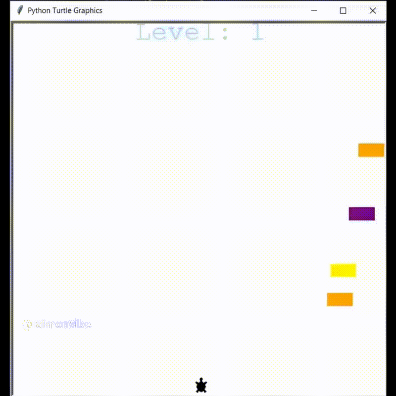

# Frogger Game

This repository contains code for a Frogger game implemented using the Turtle module in Python. The game is inspired by the classic Frogger arcade game, where the player controls a frog trying to cross a busy road without colliding with cars.

# Table of Contents
Description
Installation
Usage
Contributing
License
Description

The Frogger Game is a simple game where the player controls a frog using the arrow keys to navigate across a busy road. The goal is to reach the top edge of the screen without colliding with the moving cars. The game keeps track of the player's level and displays a scoreboard showing the current level. If the frog collides with a car, the game ends, and a "GAME OVER" message is displayed.

The code in this repository includes several classes for different game elements:

- Player: Represents the player's frog and handles its movement.
- CarManager: Manages the spawning and movement of cars on the road.
- Scoreboard: Keeps track of the player's level and displays the scoreboard.

# Installation
To run the Frogger Game, follow these steps:

Clone this repository to your local machine.
Ensure that you have Python installed on your system.
Install the Turtle module by running the command pip install PythonTurtle.
Open a terminal or command prompt and navigate to the cloned repository's directory.
Run the command python main.py to start the game.
Note: The Turtle module is included in the Python standard library, so no additional installation is required if you have a standard Python installation.

# Usage
Once the game is running, use the arrow keys on your keyboard to control the frog's movement. The goal is to safely guide the frog to the top edge of the screen without colliding with the cars. As the player progresses, the level increases, and the cars' speed becomes faster. The game ends if the frog collides with a car, and a "GAME OVER" message is displayed.

# Contributing
Contributions to this project are welcome. If you would like to contribute, please follow these guidelines:

# Fork the repository.
Create a new branch for your feature or bug fix.
Commit your changes and push the branch to your forked repository.
Submit a pull request, explaining your changes and their benefits.
License
This project is licensed under the MIT License. See the LICENSE file for more information.

# Acknowledgements
The Frogger Game is inspired by the classic Frogger arcade game, which was a popular game during the 1980s.

Contact
For any questions, suggestions, or feedback, feel free to reach out to me at info@raimoncoding.nl You can also visit my website at [https//:www.raimoncoding.com](https://www.raimoncoding.com/)
